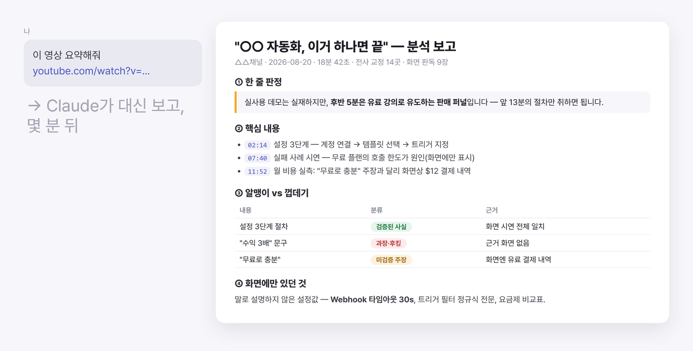
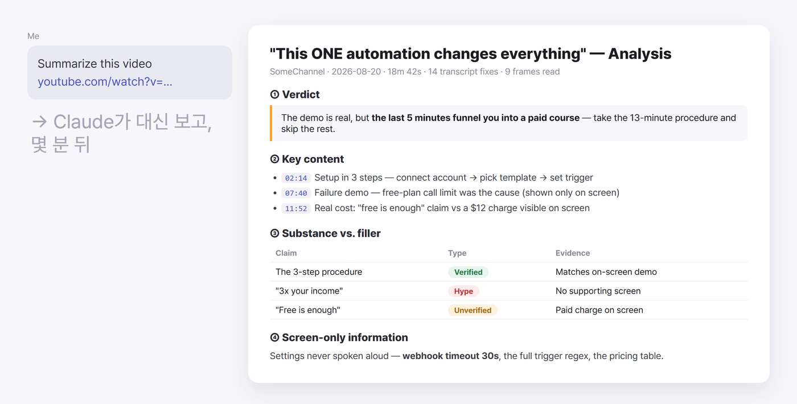

# youtube-absorb

**유튜브 영상, 보기 전에 Claude가 먼저 보고 — 믿을 수 있는 보고로 돌려드립니다.**

## 설치 — 한 줄이면 됩니다

[Claude Code](https://claude.com/claude-code)에서 이렇게 말하세요:

> **https://github.com/promotoa/youtube-absorb 를 내 스킬로 설치해줘.**

끝입니다. 필요한 프로그램(yt-dlp·ffmpeg)은 첫 실행 때 Claude가 알아서 확인하고 설치합니다.

## 이렇게 됩니다

> 이 영상 요약해줘: https://youtu.be/...

요약이 아니라 **판단**입니다 — 믿을 만한 영상인지, 알맹이가 뭔지, 말로 설명하지 않고
화면에만 지나간 정보(코드·설정값)까지 채팅 보고로 돌려받습니다.

| 절 | 내용 |
|---|---|
| ① 한 줄 판정 | 이 영상이 뭐고, 믿을 만한가 |
| ② 핵심 내용 | 타임스탬프 붙은 요약 — 영상을 안 봐도 되게 |
| ③ 알맹이 vs 껍데기 | 검증된 사실 / 미검증 주장 / 과장을 갈라서 |
| ④ 화면에만 있던 것 | 말로 설명 안 한 코드·설정값·수치 |
| ⑤ 당신 상황에서는 | 대화에서 보이는 내 상황에 비춘 시사점 (보일 때만) |
| ⑥ 다음 스텝 | 이 내용으로 이어갈 수 있는 것 — 구체 제안 |

## 특징

- **무료가 기본** — 자막 전사 경로는 API 키가 필요 없습니다. 정밀 전사(`--whisper`)만 OpenAI 키 옵션.
- **화면까지 읽습니다** — 말로 설명하지 않고 화면에만 지나간 코드·설정은 전사에 없습니다.
  프레임 판독이 그걸 건집니다.
- **영상 원본은 저장하지 않습니다** — 전사 텍스트와 선별 프레임만 남습니다.

## 요구사항

- Claude Code (또는 스킬을 지원하는 Claude 환경)
- Python 3.9+ — 나머지(yt-dlp·ffmpeg, 경우에 따라 deno)는 Claude가 첫 실행 때 알아서 챙깁니다.

---

## English

**Give Claude a YouTube link — get back a report you can trust.**

### Install — one line

In [Claude Code](https://claude.com/claude-code), just say:

> **Install https://github.com/promotoa/youtube-absorb as a skill.**

That's it. Claude checks and installs what it needs (yt-dlp, ffmpeg, deno if required) on first run.

### What you get

> Summarize this video: https://youtu.be/...

Not a summary — a **judgment**. The skill transcribes the video (free, subtitle-based),
cross-checks what actually appeared on screen, and returns a chat report instead of a wall of text —
in **your language**, whatever you ask in:

| Section | What you get |
|---|---|
| ① Verdict | What this video really is — and whether you can trust it |
| ② Key content | Timestamped summary — so you don't have to watch |
| ③ Substance vs. filler | Verified facts / unverified claims / hype, kept separate |
| ④ Screen-only information | Code, settings, numbers that were never spoken aloud |
| ⑤ For your situation | What it means for you — when your context shows in the conversation |
| ⑥ Next steps | Concrete ways to build on it — set it up, verify claims, save a summary |

### Highlights

- **Free by default** — the subtitle path needs no API key. Precision mode (`--whisper`) optionally uses an OpenAI key.
- **Reads the screen** — commands and settings that are never spoken don't exist in any transcript. Frame reading recovers them.
- **Never stores the video** — only the transcript text and a handful of selected frames remain.

Requires Python 3.9+. Everything else is Claude's job.

If this skill just saved you an hour of watching, a ⭐ goes a long way — and there's a **♥ Sponsor** button up top.

---

## 응원하기

이 스킬이 시간을 아껴줬다면 — ⭐ 스타 하나가 큰 힘이 됩니다.
후원은 **[투네이션](https://toon.at/donate/aifavorite)**(카카오페이·카드 바로 결제) 또는 상단의 **♥ Sponsor** 버튼으로
(만든 사람: [AI 즐겨찾기](https://github.com/promotoa) 채널).

## License

MIT © 2026 promotoa — [LICENSE](LICENSE)
